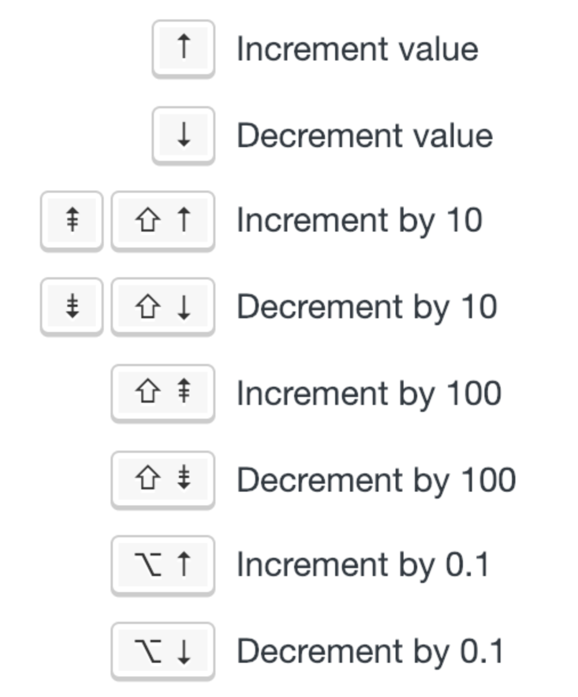
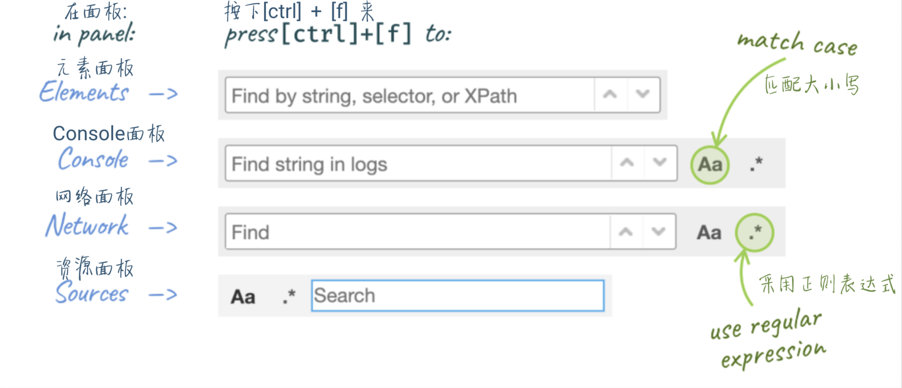
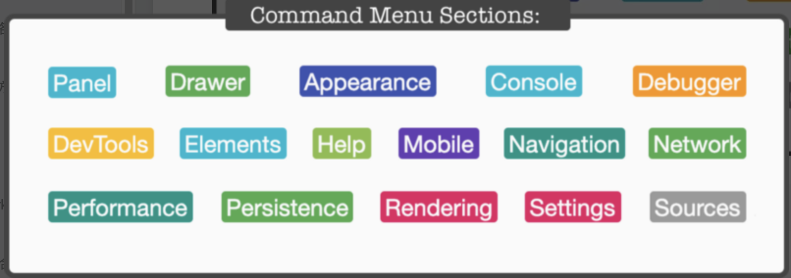
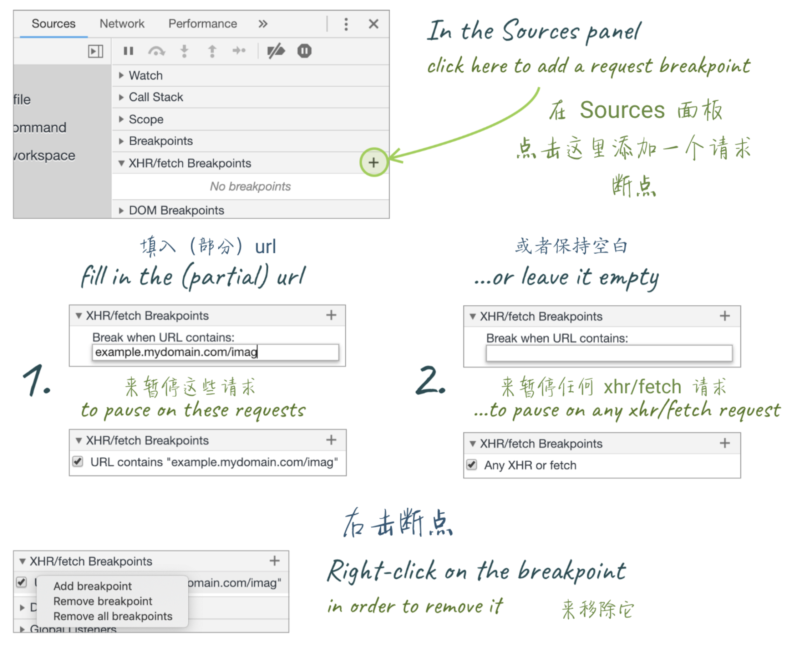
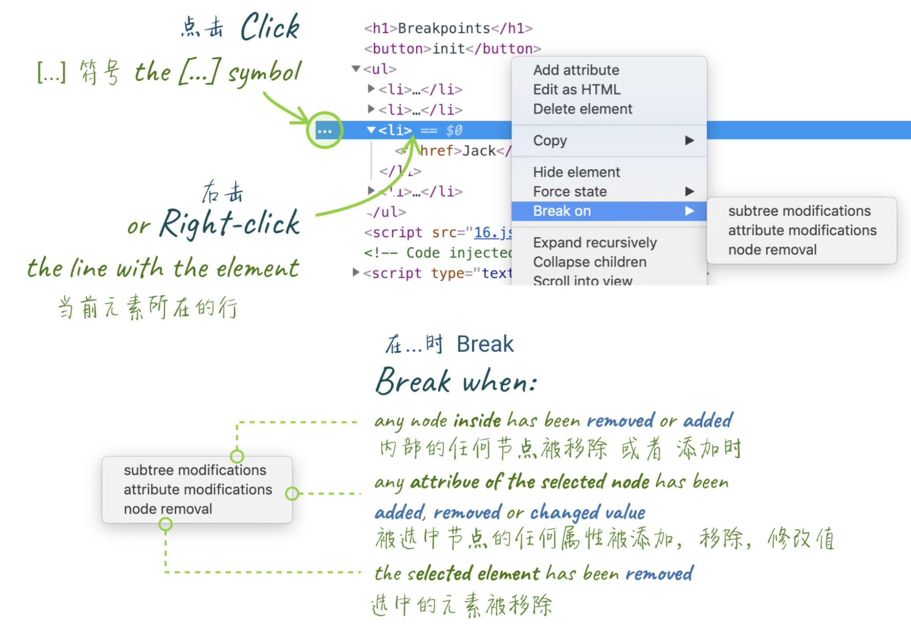
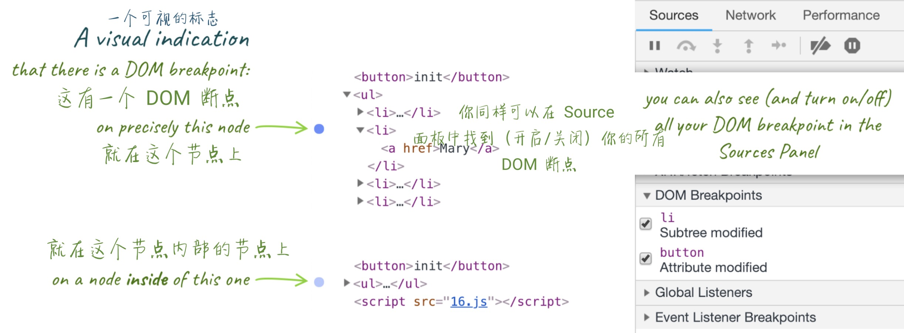
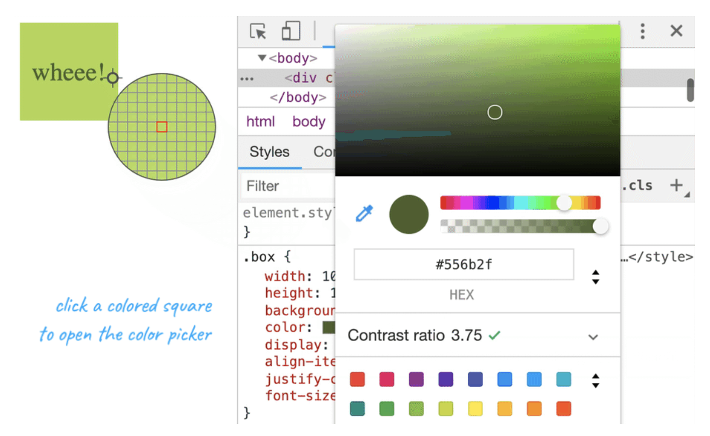
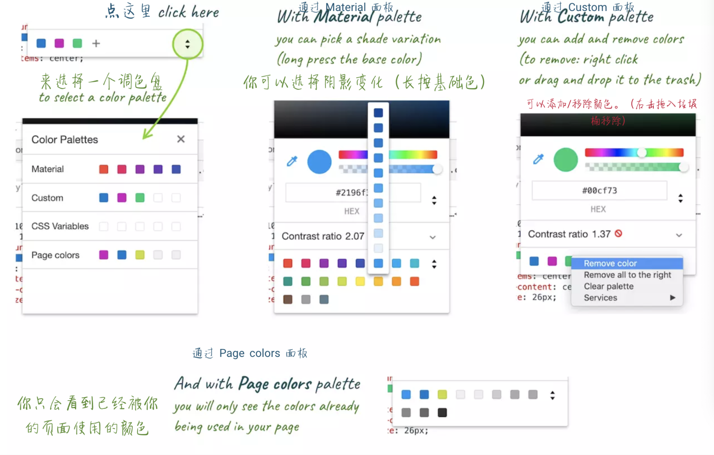
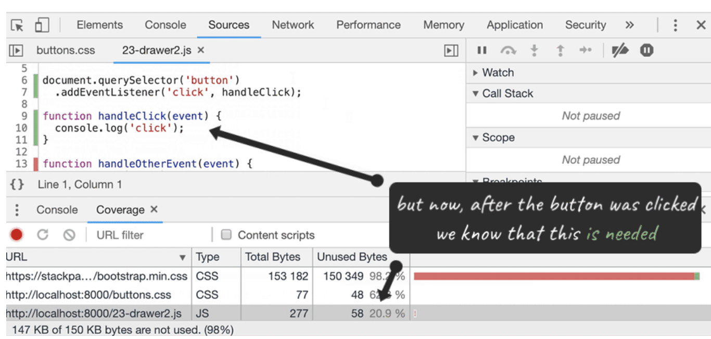

# Chrome Devtool

## 通用

<h3 style="color: #0d47a1">start 快捷键</h3>

##### 打开Devtool
	Ctrl + Shift + I (Windows) 或 Cmd + Opt + I (Mac)
##### 打开Devtool & 审查元素
	Ctrl + Shift + C (Windows) 或 Cmd + Opt + C (Mac)
	
#### 面板
- 元素面板
- 控制台面板
- 源代码面板
- 网络面板
- 性能面板
- 内存面板
- 应用面板
- 安全面板

<h3 style="color: #0d47a1">copying & saving</h3>

- copy(...)  

	location --> copy(location) --> paste  
	copy($0)
	
	
- Store as global (存储为一个全局变量)
	
	console --> 右击 -->  “Store as global variable”

- 保存堆栈信息( Stack trace )

	右击 × --> Save as ...

- 直接Copy HTML 
 
 	右击 --> save element

<h3 style="color: #0d47a1">快捷键和通用技巧</h3>

<h5 style="color: #007fff">切换 DevTools 窗口的展示布局</h5>

- Spot: ctrl + shift + D (⌘ + shift + D Mac) 
- Mobile: ctrl + shift + M (⌘ + shift + M Mac) 

<h5 style="color: #007fff">切换 DevTools 的面板</h5>

- 切换左右面板: ctrl + \[ 和 ctrl + \] (Mac 对应 ⌘)
- ctrl + 1 到 ctrl + 9 可以直接转到编号1...9的面板 (ctrl + 1转到元素面板，ctrl + 4` 转到 网络信息面板等等) P.S.: 默认禁用，DevTools --> Settings --> Preferences --> *Appearance*

<h5 style="color: #007fff">递增/递减</h5>

调整样式:
	通过使用 带有 或者 不带有修饰键 的 上 / 下 箭头按键， 你可以实现递增和递减 0.1 、 1 或者 10 这样数值类型的值  

<h5 style="color: #007fff">elements， logs， sources & network 中的查找</h5>

DevTools 中的前4个主要的面板，每一个都支持 [ctrl] + [f] 快捷方式，你可以使用对应的查询方式来查找信息:

- 在 Elements 面板中 - 通过 string ，选择器 或者 XPath 来查找
- 在 Console， Network 以及 Source 面板 - 通过区分大小写，或者可以被视为表达式的 strings， 来查找

<h3 style="color: #0d47a1">使用 Command</h3>

Command 菜单可以帮助我们快速找到那些被隐藏起来的功能

- 在 Chrome 的调试打开的情况下 按下 Ctrl + Shift + P ( Mac：⌘ + Shift + P )
- 使用 DevTools 的 dropdown 按钮下的 Run Command 选项

<h5 style="color: #007fff">截屏</h5>
- 节点：Command --> screen --> node...
- 全屏：Command --> screen --> full size...

<h5 style="color: #007fff">切换面板布局</h5>
- Command --> layout   三个选项

<h5 style="color: #007fff">切换主题</h5>
- Command --> theme

<h3 style="color: #0d47a1">代码块的使用</h3>
<h5 style="color: #007fff">保存代码块</h5>
- Source --> >> --> Snippets --> new & save --> Ctrl + Enter ( Mac：⌘  + Enter )

<h5 style="color: #007fff">各处都可使用代码块</h5>
- Command --> 输入 !

 
 

<h2>console</h2>

<h3 style="color: #0d47a1">$</h3>

<h5 style="color: #007fff">$0</h5>

- $0 是对当前选中的 html 节点的引用
- $1 是对上一次选择的节点的引用
- ... 顺推到 $4

可以尝试一些相关操作(例如: $1.appendChild($0))

<h5 style="color: #007fff">$ 和 $$</h5>

如果项目中没有定义过`$`

- `$ == querySelector`
- `$$ == querySelectorAll`

<h5 style="color: #007fff">$_</h5>

- `$_`: 对上次执行的结果的引用

<h5 style="color: #007fff">$i</h5>

插件：[Console Importer](https://chrome.google.com/webstore/detail/console-importer/hgajpakhafplebkdljleajgbpdmplhie/related)

- `$i('lodash')`
- `$i('moment')`
- ...

<h5 style="color: #0d47a1">Conditional breakpoints 条件断点</h5>

- 右击行号，选择 Add conditional breakpoint...(添加条件断点)
- 已经设置: Edit breakpoint(编辑断点)

<h5 style="color: #0d47a1">BreakPoints Section</h5>

- 右击 --> disable all ...

<h5 style="color: #0d47a1">console.?</h5>

1. console.assert

2. 增强 log 的阅读体验: console.log({ var1, var2 })

3. console.table(): 适用于数组、类数组、对象，第二个参数传想看的列

4. console.dir(): 查看DOM节点所关联到的真实的js对象  
div = $('div'): 可以创建一个DOM元素

5. 监测执行时间  
console.time() — 开启一个计时器  
console.timeEnd() — 结束计时并且将结果在 console 中打印出来
可以传入一个标签值

6. "眼睛" 符号, 定义任何JavaScript表达式: location.href
7. 给 logs 加上时间戳: Command --> timestamps
8. console.log 加上 CSS 样式: console.log('%cWhoops...','font-size: 50px; color: red;')

 
 

<h2>Network</h2>

1. Request initiator 显示了调用堆栈信息  
显明了是哪个脚本的哪一行触发了请求  
显示了在调用堆栈中触发请求的最后一步  
会指向一些低层级的类库

2. 过滤器: 可以输入字符串或正则表达式，过滤请求，Ctrl + Space显示所有可能的关键字  
domain
method

3. 请求表：在表头上右键可以添加列（我经常添加Method）  
initiator列: 显示调用堆栈信息，显示哪个脚本的哪一行触发了请求  
Response Headers: 控制响应头的显示

4. 重新发送 XHR 的请求（表头的Type是xhr类型的才会有）

5. XHR/fetch 断点

 
 

<h2>元素面板</h2>

<h3 style="color: #0d47a1">小技巧</h3>

<h5 style="color: #007fff">h</h5>
  通过 'h' 来隐藏元素
  
<h5 style="color: #007fff">拖动 & 放置 元素</h5>
  Elements里

<h5 style="color: #007fff">使用 control (按钮) 来移动元素</h5>
  [ctrl] + [⬆] / [ctrl] + [⬇]  
  \([⌘] + [⬆] / [⌘] + [⬇] on Mac)

<h5 style="color: #007fff">元素面板中类似于基础编辑器的操作</h5>
编辑、撤销：  

- [ctrl] + [z]  
- \([⌘] + [z] on Mac)

<h5 style="color: #007fff">Shadow editor 阴影编辑器</h5>
Style面板 --> box-shadow / text-shadow属性 --> 阴影方形符号

<h5 style="color: #007fff">Timing function editor 定时函数编辑器</h5>
如果timing 函数的值没有设置在这个简写的形式中，这个符号不会显示出来)边上的曲线符号

<h5 style="color: #007fff">插入样式规则的按钮</h5>
把鼠标放在样式选择器的选择区域的最后时，显示可以快速的使用 Color 和 Shadow 编辑器添加 CSS 属性的按钮：

- text-shadow
- box-shadow
- color
- background-color

<h5 style="color: #007fff">在元素面板中展开所有的子节点</h5>
右击节点后的 expand recursively 命令

<h5 style="color: #007fff">DOM 断点</h5>
追踪DOM的修改  

- 选择 subtree modifications :监听任何它内部的节点被 移除 或者 添加的事件
- 选择 attribute modifications :监听任何当前选中的节点被 添加，移除 或者 被修改值的事件
- 选择 node removal :监听被选中的元素被 移除 的事件

断点列表

 
 
 

<h3 style="color: #0d47a1">颜色选择器</h3>

<h5 style="color: #007fff">只选择你正在用的颜色</h5>
介绍颜色选择器的一部分：

- 切换到一个有色调变化的 Material 调色板
- 自定义，可以添加和删除颜色
- 从 CSS Variables 中选择一个你当前页面使用的样式表中存在的颜色
- 或者所有你在页面的 CSS 中使用的颜色

<h5 style="color: #007fff">直观的选择你的颜色</h5>

文本的调色选择器(color 属性) --> Contrast ratio(对比度):
**文本的颜色** 与 **开发者工具认为这段文本应该有的背景颜色** 之间的对比度

- 在数字边上的 “🚫” 意味着对比度太低
- 一个 “✅” 意味着这个颜色遵从 [Web Content Accessibility Guidelines (WCAG) 2.0](https://www.w3.org/TR/UNDERSTANDING-WCAG20/conformance.html) 的 AA 声明，这意味着对比值至少为 3
- “✅ ✅” 意味着满足了 AAA 声明

 

<h2>Drawer</h2>

有一组平行的选项卡，被隐藏在主窗口之下。这个组合被称为 Drawer，可在其他面板视图下查看 console等等。。。

<h5 style="color: #007fff">如何打开 Drawer</h5>
在 DevTools（任何选项卡）中时，按 [esc] 来显示它，再次按 [esc] 隐藏它

<h5 style="color: #007fff">Drawer 里面到底有什么</h5>
- 点击主页面在 Drawer的 console 面板前面的 ⋮ 图标来打开完整选项列表
- Command --> Drawer

再看一遍所有的选项：

- Animations
- Changes
- Console
- Coverage
- Network conditions
- Performance monitor
- Quick source
- Remote devices
- Rendering
- Request blocking
- Search
- Sensors
- What’s new

<h5 style="color: #007fff">控制传感器</h5>
Drawer --> Sensors(传感器)

<h5 style="color: #007fff">模拟网络状态</h5>
Drawer --> Network conditions

<h5 style="color: #007fff">拿到 source</h5>
Drawer --> Quick Source
设置断点。。。

<h5 style="color: #007fff">检查代码 coverage</h5>
Drawer --> Coverage

 

<h2>Outro</h2>
结合[google官方开发者工具](https://developers.google.com/web/tools/chrome-devtools/) 一起食用效果更佳